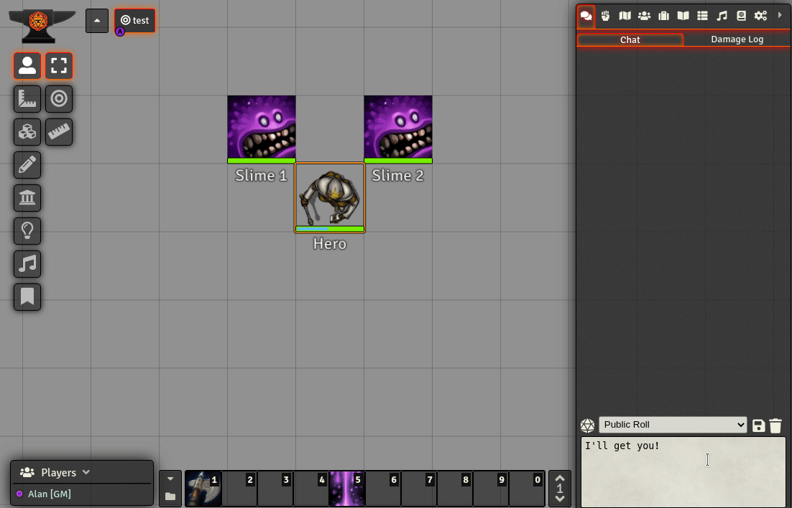

 # Damage Log

Damage Log is a FoundryVTT module that monitiors for changes to characters' health, and displays those changes in a separate chatlog tab (currently only viewable by the GM).  Changes can be easily be undone, or re-applied using the chat card's right-click menu.

Damage Log is also compatible with the [Tabbed Chatlog](https://github.com/cswendrowski/FoundryVTT-Tabbed-Chatlog) module, and will add an extra tab on to the end of Tabbed Chatlog's tabs.

## System Compatibility
Damage Log is current compatible with the following systems.
* Dungeons & Dragons 5th Edition (dnd5e)
* Pathfinder 1st Edition (pf1)
* Pathfinder 2nd Edition (pf2e)
* Simple Worldbuilding (worldbuilding)

## Installation
Damage Log can be installed using the Foundry module installer.  Alternatively, you can install it using the following manifest URL...
https://github.com/cs96and/FoundryVTT-damage-log/releases/latest/download/module.json

## Support Me
If you find this module useful and would like to offer your support, why not buy me a coffee (or a beer)?

